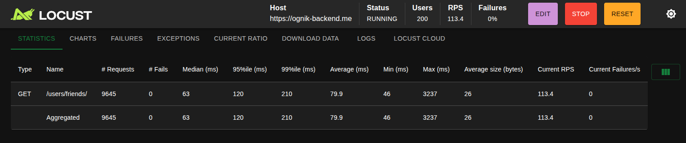
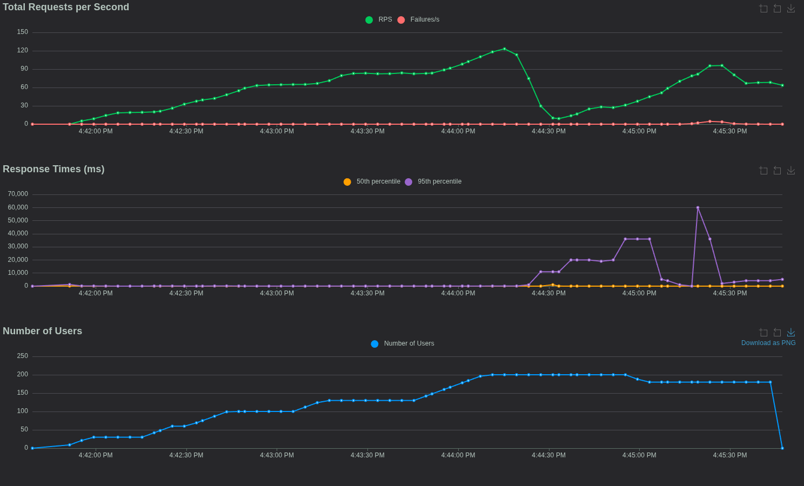

# Benchmarks

## REST API Performance (Hosted)
Simulated simple GET requests to fetch a user's friends list; The file containing the test is available in the same directory. 
I ran the test from my local machine, fetching data from a backend hosted on Azure.

- **Tool**: Locust 2.15.1
- **Command**: `locust -f locustfile.py`
- **Environment**: Azure VM (2 threads, 1GB RAM)
- **Results**:
  - Requests/sec: 120
  - Average Latency: 79ms
  - Simulated Users: 200 (with 0% failure rate)
- **Screenshots**:
  -  
  -  
